# Chapter 3: Transport Layer

- understand
  - `multiplexing`
  - `demultiplexing`
  - `reliable data transfer`
  - `flow control`
  - `congestion control`
- learn
  - UDP: connectionless transport
  - TCP: connection-oriented reliable trasnport
  - TCP congestion controle

## 3.1 transport-layer services

- A <u>transport-layer protocol</u> provides for __logical communication__ between application processes running on different hosts.
- On the sending side, the transport layer converts the application-layer messages it receives from a sending application process into transport-layer packets, known as transport-layer **segments**.
- It's important to note that network routers act only on the network-layer fields of the datagram; that is, they do not examine the fields of the transport-layer segment encapsulated with the datagram.

### 3.1.1. Relationship between Transport and Network Layers

- A <u>network-layer protocol</u> provides logical communication between *hosts*.
- Household analogy: the services that a transport protocol can provide are often constrained by the service model of the underlying network-layer protocol.

### 3.1.2 Overview of the Transport Layer in the Internet

- __UDP__ (User Datagram Protocol), which provides an unreliable, connectionless service to the invoking application.
- __TCP__ (Transmission Control Protocol), which provides a reliable, connection-oriented service to the invoking application.
- We refer to the transport-layer packet as a *segment*, reserve the term *datagram* for the network-layer packet.
- __IP__ (Internet Protocol) provides logical communication between hosts. The IP service model is a __best-effort delivery service__. This means that IP makes its "best effort" to deliver segments between communicating hosts, *but it makes no guarantees*. In particular, it does not guarantee
  - segment delivery,
  - orderly delivery of segments, and
  - the integrity of the data in the segments.
- IP is said to be an __unreliable service__. *Each host has an IP address.*
- The most fundamental responsibility of UDP and TCP is to extend IP's delivery service between two end systems to a delivery services between two processes running on the end systems. Extending host-to-host delivery to processs-to-process delivery is called __transport-layer multiplexing__ and __demultiplexing__.
- UDP: only two transport-layer services
  - process-to-process data delivery
  - error checking (segment header)
- TCP
  - reliable data transfer (flow control, sequence numbers, acknowledgements, and timers).
  - congestion control

## 3.2 Multiplexing and Demultiplexing

- At the receiving end, the transport layer examines these fields to identify the receiving socket and then directs the segment to that socket. This job of delivering the data in a trasnport-layer segment to the correct socket is called __demultiplexing__.

- The job of gathering data chunks at the source host from different sockets, encapsulating each data chunk with header information (that will later be used in demultiplexing) to create segments, and passing the segments to the network layer is called __multiplexing__.

- Transport-Layer multiplexing requires

  - (1) that sockets have unique identifiers, and
  - (2) that each segment have special fields that indicate the socket to which the segment is to be delivered. These special fields are the __source port number field__ and the __destination port number firld__.

  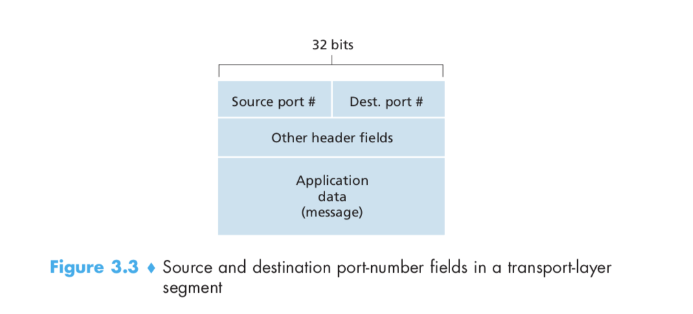

  

- The port numbers ranging from 0 to 1023 are called __well-known port numbers__ and are restricted.

#### Connectionless Multiplexing and Demultiplexing

```c++
clientSocket = socket(socket.AF_INEF, socket.SOCK_DGRAM);
clientSocket.bind(('', 19157))
```

- A UDP socket is fully identified by a two-tuple consisting of a destination IP address and a destination port number. As a consequence, if two UDP segments have different source IP addresses and/or source port bunkers, but have the <u>same *destination* IP address and *destination* port number</u>, then the two segments will be directed to the same destination process via the <u>same destination</u> socket.

#### Connection-Oriented Multiplexing and Demultiplexing

```c++
// request
clientSocket = socket(AF_INEF, SOCK_STREAM);
clientSocket.connect((serverName, 12000));
// creates a new socket
connectionSocket, addr = serverSocket.accept();
```

- One subtle difference between a TCP socket and a UDP socket is that a TCP socket is identified by a four-tuple: (source IP address, source port number, destination IP address, destination port number)
- Two arriving TCO segments with different source IP addresses or source port numbers will (with the exception of a TCP segment carrying the original connection-establishment request) be directed to two different sockets.

## 3.3 Connectionless Transport: UDP

- Many applications are better suited for UDP for the following reasons:
  - *Finer application-level control over what data is sent, and when.* As soon as an application process passes data to UDP, UDP will package the data inside a UDP segment and immediately pass the segment to the network layer.
  - *No connection establishment*. UDP does not introduce any delay to establish a connection.
  - *No connection state*. A server devoted to a particular application can typically support many more active clients when the application runs over UDP rather than TCP.
  - *Small packet header overhead*. TCP segment has 20 bytes of header overhead in every segment, whereas UDP has only 8 bytes of overhead.

### 3.3.1 UDP Segment Structure

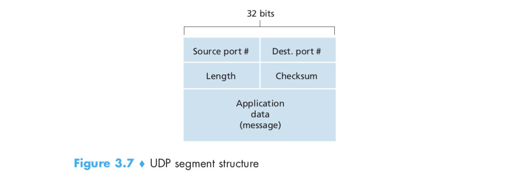

### 3.3.2 UDP Checksum

- The UDP checksum provides for error detection. The checksum is used to determine whether bits within the UDP segment have been altered (e.g. by noise in the link or while stored in a router) as it moved from source to destination.
- At the receiver, all four 16-bit words are added, including the checksum. If no error are introduced into the packet, then clearly the sum at the reviewer will be `1111111111111111`.
- <u>The reason (of error checking in UDP)</u> is that there is no guarantee that all the links between source and destination provide error checking; that is, one of the links may use a link-layer protocol that does not provide error checking. Furthermore, even if segments are correctly transferred across a link, it's possible that bit errors could be introduced when a segment is stored in a router's memory.
- This is an example of the celebrated __end-end principle__ in system design [Saltzer 1984], which states that since certain functionality (error detection, in this case) must be implemented on an end-end basis: *"functions placed at the lower levels may be redundant or of little value when compared to the cost of providing them at the higher level."*

## 3.4 Principles of Reliable Data Transfer

- With a reliable channel, no transferred data bits are corrupted (flipped from 0 to 1, or vice versa) or lost, and all are delivered in the order in which they were sent. this precisely the service model offered by TCP to the Internet applications that invoke it. It is the responsibility of a __reliable data transfer protocol__ to implement this service abstraction.
- The sending side of the data transfer protocol will be invoked by a call to `rdt_send()`. It will pass the data to be delivered to the upper layer at the receiving side. (`rdt` stands for *reliable data transfer* protocol and `_send` indicated that the sending side of `rdt` is being called.)
- On the receiving side, `rdt_rcv()` will be called when a packet srrrives from the receiving aide of the channel. When the `rdt` protocol  wants to deliver data to the upper layer, it will do so by calling `deliver_data()`.
- We consider only the case of __unidirectional data transfer__, that is, data transfer from the sending to the receiving side. The case of reliable __bidirectional__ (i.e. full-duplex) __data transfer__ is conceptually no more difficult but considerably more tedious to explain.
- Both the send and receive sides of `rdt` send packets to the other side by a call to `udt_send()` (where udt stands for *unreliable data transfer*).

### 3.4.1 Building a Reliable Data Transfer Protocol

#### Reliable Data Transfer over a Perfectly Reliable Channel: `rdt1.0`

- We first consider the simplest case, in which the underlying channel is completely reliable. The protocol itself, which we w'll call `rdt1.0` , is trivial. The __finite-state machine (FSM)__ definitions for the `rdt1.0` sender and receiver are shown below. It is important to note that there are `separate` FSMs for the sender and for the receiver.

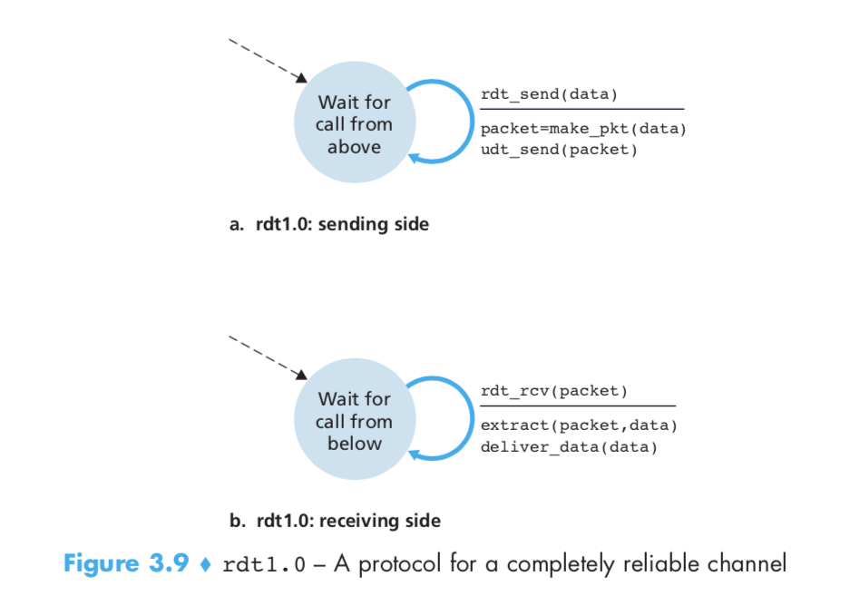

- In this simple protocol, there is no difference between a unit of data and a packet. Also, all packet flow is from the sender to receiver; there is no need to provide and feedback from both ends. We also assumed that the receiver is able to receive data as fast as the sender happened two deaf data.

#### Reliable Data Transfer over a Channel with Bit Errors: `rdt2.0`

- In a computer network setting, reliable data transfer protocols based on such retransmission (__positive acknowledgement__, i.e. "OK", and **negative acknowledgement**, i.e. "Please repeat that.") are known as __ARQ (Automatic Repeat reQuest)__.

- Fundamentally, three additional protocol capabilities are required in ARQ protocols to handle the presence of bit errors:

  - *Error detection*. There techniques require that extra bits (beyond the bits of original data to be transferred) be sent from the sender to the receiver; these bits will be gathered into the packet checksum field of the `rdt2.0` data packet.
  - *Receiver feedback*. `rdt2.0` protocol send positive (ACK) and negative (NAK) acknowledgement packets back from the receiver to the sender. These packets need only be one bit long.
  - *Retransmission*. A packet that is received in error at the receiver will be retransmitted by the sender.

  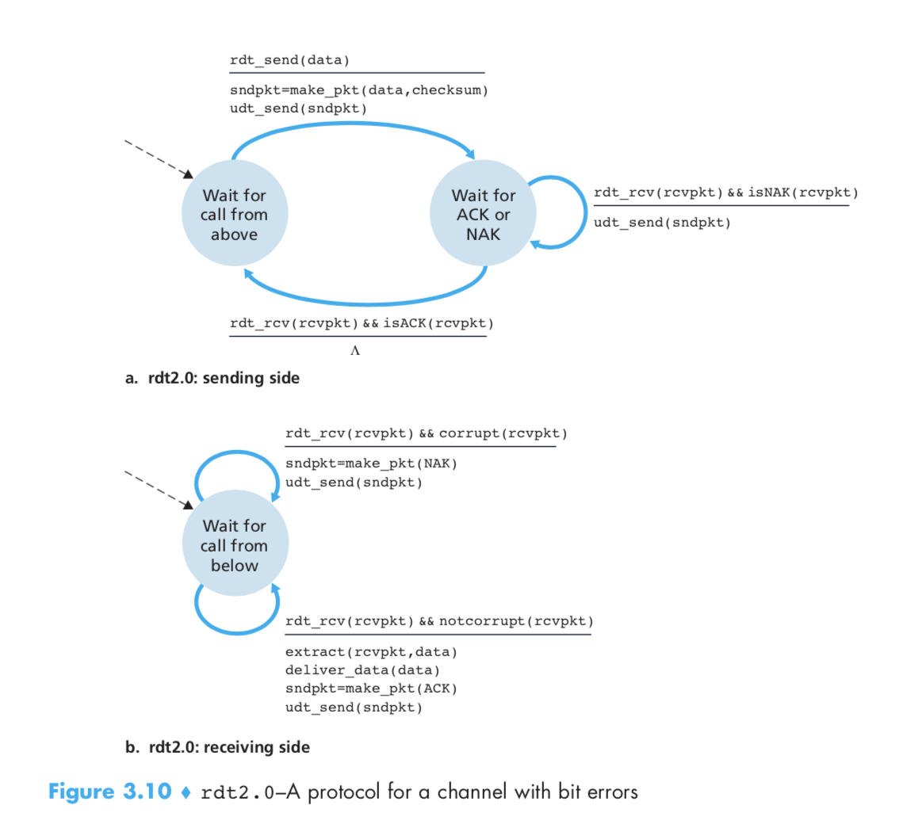

- When the `rdt_send(data)` event occurs, the sender will create a packet (`sndpkt`) containing the data to be sent, along with a packet checksum and then send the packet via the `udt_send(sndpkt)` operation.

- The sender protocol is waiting for an ACK or a NAK packet from the receiver. If an ACK packet is received (`rdt_rcv(rcvpkt) && isACK(rcvpkt)`), the sender knows that the most recently transmitted packet has been received correctly and thus the protocol returns to the state of waiting for data from the upper layer. If a NAK is received, the protocol retransmits the last packet and waits for an ACK or NAK to be returned by the receiver in response to the retransmitted data packet.

- When the sender is in the wait-for-ACK-or-NAK state, it *cannot* get more data from the upper layer that is, the `rdt_send()` event can not occur; that will happen only after the sender receives an ACK and leaves this state. Protocols such as `rdt2.0` are also known as __stop-and-wait__ protocols.

- Fatal flaw - the possibility that the ACL or NAK packet could be corrupted. Minimally, we will need to add checksum bits to ACK/NAK packets in order to detect such errors. If an ACK or NAK is corrupted, the sender has no way of knowing whether or not the receiver has correctly received the last piece of transmitted data.

  - could introduce __duplicate packets__ into the sender-to-receiver channel. The fundamental difficulty with duplicate packets is that the receiver doesn't know whether the ACK or NAK it last sent was received correctly at the sender.

- A simple solution to this new problem is to add a new field to the data packet and have the sender number its data packets by putting a **sequence number** into this field.

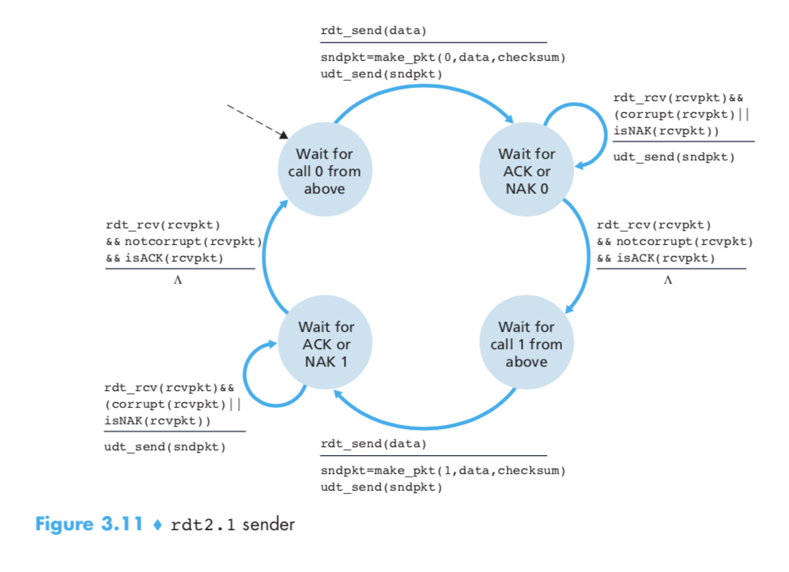

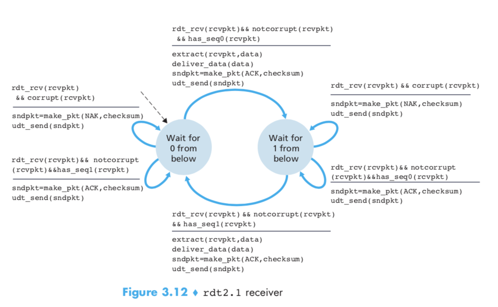

- When an out-of-order packet is received, the receiver sends a positive acknowledgment for the packet it has received. When a corrupted packet is received, the receiver sends a negative acknowledgement.

  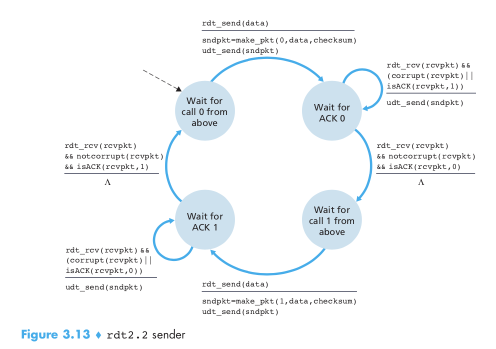

  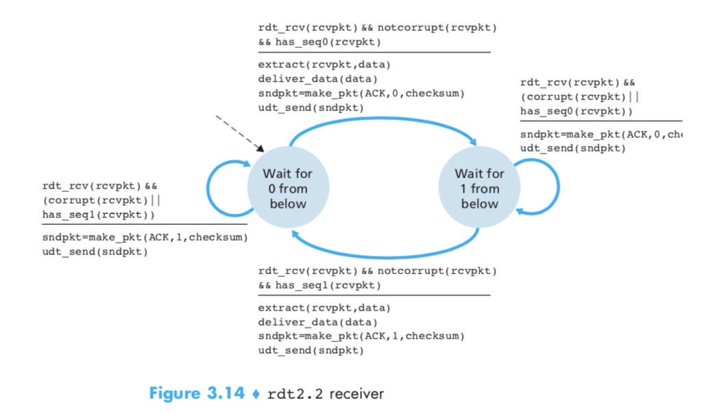

- We can accomplish the same effect as a NAK if, instead of sending a NAK, we send an ACK for the last correctly received packet. A sender that receives two ACKs for the same packet (that is, received **duplicate ACKs**) knows that the receiver did not correctly receive the packet following the packet that is being ACKed twice.

- One subtle change between `rtdt2.1` and `rdt2.2` is that the receiver must now include the sequence number of the packet being acknowledged by an ACK message (`ACK 0` or `ACK 1` in `make_pkt()`), and the sender must now check the sequence number of the packet being acknowledged by a received ACK message (`0` or `1` in `isACK()`).

#### Reliable Data Transfer over a Lossy Channel with Bit Errors: `rdt3.0`

- Implementing a time-based retransmission mechanism requires a **countdown timer** that can interrupt the sender after a given amount of time has expired. The sender will thus need two be able to
  - (1) start the timer each time a packet is sent,
  - (2) respond to a timer interrupt, and
  - (3) stop the timer.

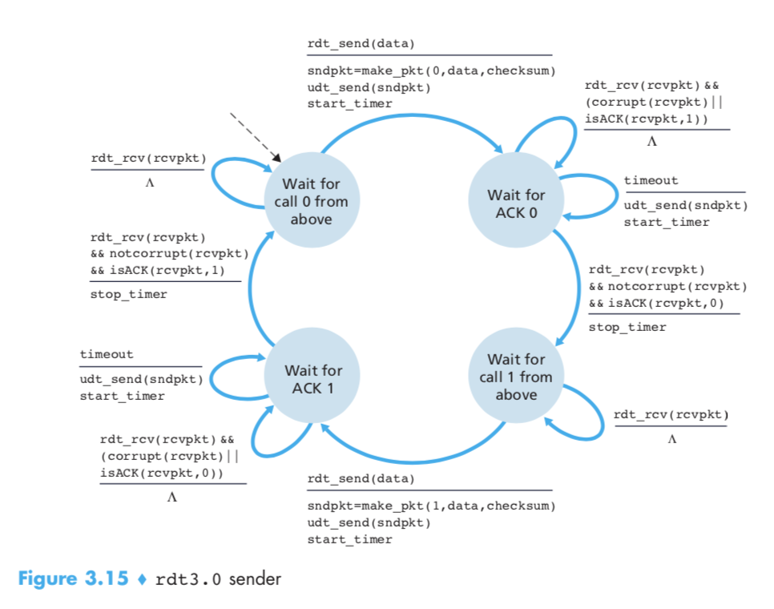

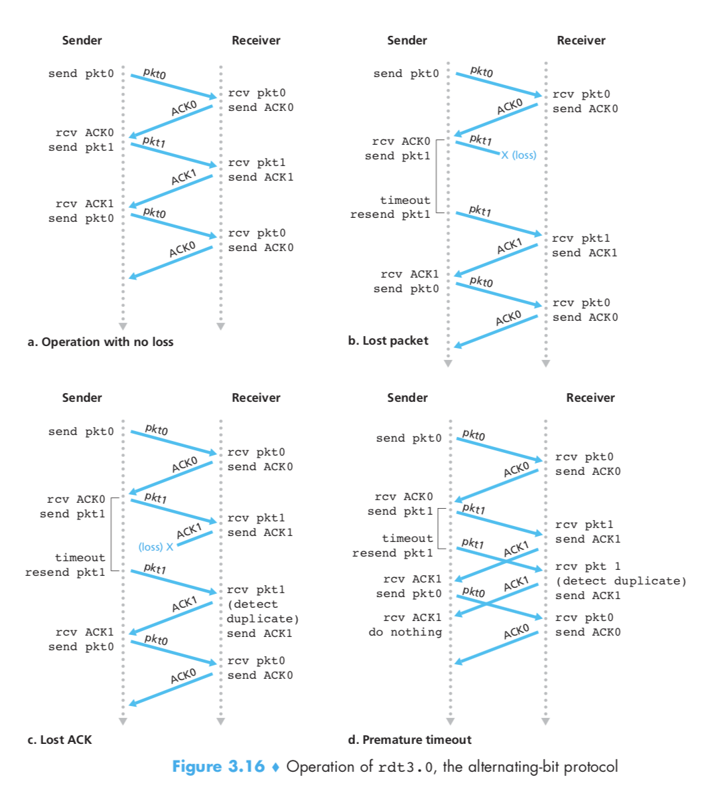

- Note that a receive time for a packet is necessarily later than the send time for a packets as a result of transmission and propagation delays. Because packet sequence numbers alternate between 0 and 1, protocol `rdt3.0` is sometimes known as the **alternating-bit protocol**.

### 3.4.2 Pipelined Reliable Data  Transfer Protocols

- Performance problem - calculation
- Solution - pipelining
  - The range of sequence numbers must be increased, since each in-transit packet must have a unique sequence number and there may be multiple, in-transit, unacknowledged packets.
  - The sender and receiver sides of the protocols may have to buffer more than one packet. Minimally, the sender will have to buffer packets that have been transmitted but not yet acknowledged.
  - The range of sequence numbers needed and the buffering requirements will depend on the manner in which a data transfer protocol responds to lost, corrupted, and overly delayed packets.

### 3.4.3 Go-Back-N (GBN)

- In a __Go-Back-N (GBN) protocol__, the sender is allowed to transmit multiple packets without waiting for an acknowledgement, but is constrained to have no more than some maximum allowable number, N, of unacknowledged packets in the pipeline.

  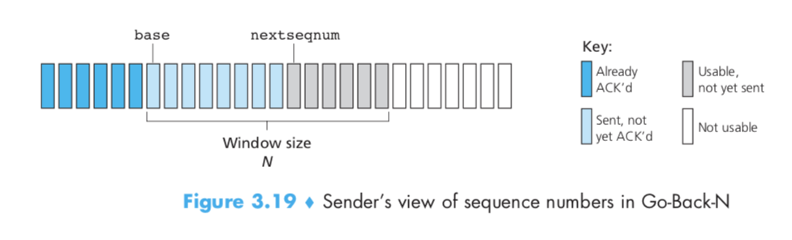

- If we define `base` to be the sequence number of the oldest unacknowledged packet and `nextseqnum` to be the smallest unused sequence number (i.e. the sequence number of the next packet to be sent), then four intervals in the range of sequence numbers can be identified.

- $N$ is often referred to as the __window size__ and the GBN protocol itself as a __sliding-window protocol__. 

- If $k$ is the number of bits in the packet sequence number field, the range of sequence numbers is thus $[0,2^k - 1]$. With a finite range of sequence numbers, all arithmetic involving sequence numbers must then be done using modulo $2^k$ arithmetic. (That is, the sequence number space can be thought of as a ring of size $2^k$, where sequence number $2^k -1$ is immediately followed by sequence number 0)

  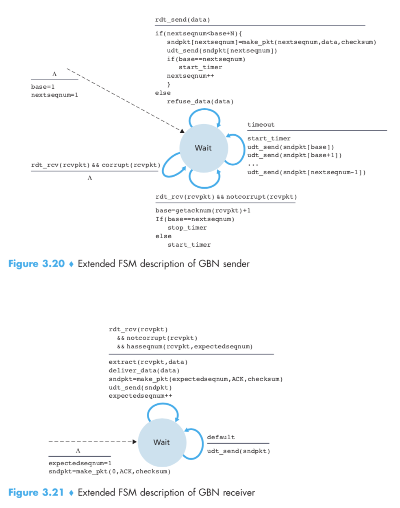

- Extended FSM description of sender and receiver sides of an ACK-based, NAK-free, GBN protocol.

- GBN sender:

  - *Invocation from above*. When `rdt_send()` is called from above, the sender first checks to see if the window id full, that is, whether there are $N$ outstanding, unacknowledged packets. If not full, a packet is created and sent, and variables are appropriately updated. If full, the sender simply returns the data back to the upper layer, an implicit indication that the window is full. The upper layer would presumably then have to try again later.
  - *Receipt of an ACK*. An acknowledgement for a packet with sequence number $n$ will be taken to be a **cumulative acknowledgement**, indicating that all packets with a sequence number up to and including $n$ have been correctly received at the receiver.
  - A *timeout event*. If a timeout occurs, the sender resends *all* packets that have been previously sent but that have not yet been acknowledged.

- GBN receiver:

  - If a packet with sequence number $n$ is received correctly and is in order (i.e. the data let delivered to the upper layer came from a packet with sequence number $n-1$), the receiver sends an $ACK$ for packet $n$ and delivers the data portion of the packet to the upper layer.
  - In all other cases, the receiver discards the packet and resends an ACK for the most recently received in-order packet.

- While the sender must maintain the upper and lower bounds of its window and the position of `nextseqnum` within this window, the only piece of information the receiver need maintain is the sequence number of the next in-order packet. This value is held in the variable `expectedseqnum`.

- In the sender, these events would be

  - (1) a call from the upper-layer entity to invoke `rdt_send()`,
  - (2) a timer interrupt, and
  - (3) a call from the lower layer to invoke `rdt_rcv()` when a packet arrives.

### 3.4.4 Selective Repeat (SR)

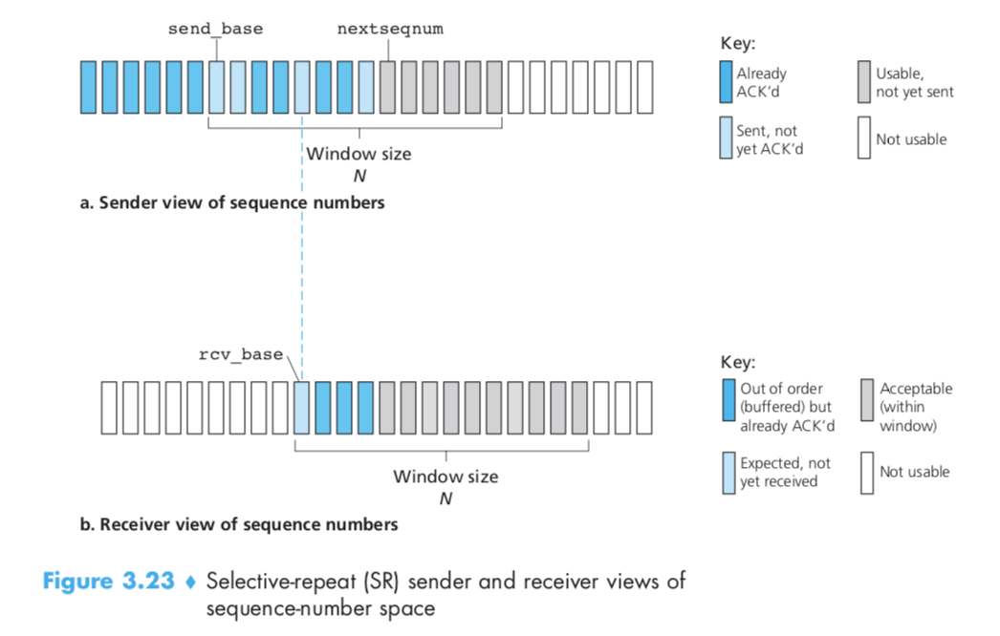

- SR sender:

  - *Data received from above*. When data is received from above, the SR sender checks the next available sequence number for the packet
  - *Timeout*. Timers are again used to protect against lost packets. However, each packet must now have its own logical timer, since only a single packet will be transmitted on timeout
  - *ACK received*. If an ACK is received, the SR sender marks that packet as having been received, provided it is in the window. If the packet's sequence number is equal to `send_base`, the window base is moved forward to the unacknowledged packet with the smallest sequence number. If the window moves and there are untransmitted packets with sequence numbers that now fall within the window, these packets are transmitted.
- SR receiver:
  - *Packet with sequence number in* `[rcv_base, rcv_base+N-1]` *is correctly received*.
  - *Packet with sequence number in* `[rcv_base-N, rcv_base-1]` *is correctly received*.
  - *Otherwise*. Ignore the packet.

## 3.5 Connection-Oriented Transport: TCP

### 3.5.1 The TCP Connection

- TCP is said to be **connection-oriented** because before one application process can begin to send data to another, the two processes must first "handshake" with each other — that is, they must send some preliminary segments to each other to establish the parameters of the ensuing data transfer.
- TCP connection provides a **full-duplex service**: If there is a TCP connection between Process A on one host and Process B on another host, then application-layer data can flow from Process A to Process B at the same time as application-layer data flows from Process B to Process A.
- TCP connection is also alywas **point-to-point**, that is, between a single sender and s single receiver. So-called "multicasting" is not possible with TCP.
- Because three segments are sent between the two hosts, this connection-establishment procedure is often rederrred to as a **three-way handshake**.
- The maximum amount of data that can be grabbed and applied in a segment is limited by the **maximum segment size (MSS)**.
- The MSS is typically set by first determining the length of the largest link-layer frame that can be sent by the local sending host (the so-called **maximum transmission unit, MTU**), and then setting the MSS to ensure that a TCP segment plus the TCP/IP header length will fit into a single line-layer frame.

### 3.5.2 TCP Segment Structure

[image TCP segment structure p.234]

- A TCP segment header contains the following fields:
  - As with UDP, the header includes **source and destination port numbers**, which are used for multiplexing/demultiplexing data from/to upper-layer applications. Also, as with UDP, the header includes a **checksum field**.
  - The 32-bit **sequence number field** and the 32-bit **acknowledgement number field** are used by the TCP sender and receiver in implementing a reliable data transfer service.
  - The 16-bit **receive window** field is used for flow control.
  - The 4-bit **header length field** specifies the length of the TCP header in 32-bit words.
  - others

#### Sequence Numbers and Acknowledgement Numbers

[image TCP segments p.236]

- The **sequence number for a segment** is the byte-stream number of the first byte in the segment.
- Because TCP only acknowledges bytes up to the first missing byte in the stream, TCP is said to provide **cumulative acknowledgement**.

[image TCP telnet example p.238]

- Note that the acknowledgment for client-to-server data is carried in a segment carrying server-to-client data; this acknowledgement is said to be **piggyback** on the server-to-client data segment.

### 3.5.3 Round-Trip Time Estimation and Timeout

#### Estimating the Round-Trip Time

- The sample RTT, denoted `SampleRTT`, for a segment is the amount of time between when the segment is sent (that is, passed to IP) and when an acknowledgement for the segment is received.
- `EstimatedRTT = ` $(1-\alpha)$ $\cdot$ `EstimatedRTT` + $\alpha$ $\cdot$ `SimpleRTT`
  - exponential weighted moving average
  - influence of past sample decreases exponentially fast, typical value: $\alpha = 0.125$

#### Setting and Managing the Retransmission Timeout Interval

- `TimeoutInterval = ` `EstimatedRTT` + 4 $\cdot$ `DevRTT`
- timeout interval: `EstimatedRTT` plus "safety margin"
  - large variation in `EstimatedRTT` -> larger safety margin


==Note: As an experiment, from below, the notes are guided by the slides instead of the textbook==

### 3.5.4 Reliable Data Transfer

- TCP created `rdt` service on top of IP's unreliable service
  - pipelined segments
  - cumulative acks
  - single retransmission timer
- retransmissions triggered by:
  - timeout events
  - duplicate acks

#### TCP sender events

- **data received from application**
  - create segment with sequence number
  - sequence number is byte-stream number of first data byte in segment
  - start timer if not already running
    - think of timer as for oldest unasked segment
    - expiration interval: `TimeOutInterval`
- **timeout**
  - retransmit segment that caused timeout
  - restart timer
- **acknowledgement received**
  - if acknowledgement acknowledges previously unacknowledged segments
    - update what is known to be ACKed
    - start timer if there are still unacknowledged segments

[TCP sender (simplified) (67)]

#### TCP: retransmission scenarios

- lost ACK scenario (68)
- premature timeout (68)
- cumulative ACK (69)

#### TCP ACK generation

- (70)

#### TCP fast retransmit

- time-out period often relatively long:
  - long delay before resending lost packet
- detect lost segments via duplicate ACKs
  - sender often sends many segments back-to-back
  - if segment is lost, there will likely be many duplicate ACKs
- If sender receives 3 ACKs for same data ("triple duplicate ACKs"), resend unacknowledged segment with smallest sequence number
  - likely that unacknowledged segment lost, so don't wait fro timeout
- (72)

### 3.5.5 Flow Control

- receiver controls sender, so sender won't overflow receiver's buffer by transmitting too much, too fast
- receiver "advertises" free buffer space by including `rwnd` value in TCP header of receiver-to-sender segments
  - `RcvBuffer` size set via socket options (typical default is 4086 bytes)
  - many operating systems sutoadjust `RcvBuffer`
- sender limits amount of unacknowledged ("in-flight") data to receiver's `rwnd` value
- guarantees receive buffer will not overflow

### 3.5.6 TCP Connection Management

- before exchanging data, sender/receiver "handshake":
  - agree to establish connection (each knowing the other willing to establish connection)
  - agree on connection parameters
- Q: will 2-way handshake always work in network?
  - variable delays
  - retransmitted messages (e.g. `req_conn(x)`) due to message loss
  - message reordering
  - can't "see" other side
- [2-way handshake failure scenarios (79)]
- [TCP 3-way handshake (80)]
- TCP: closing a connection
  - client, server each close their side of connection
    - send TCP segment with FIN bit = 1
  - respond to received FIN with ACK
    - on receiving FIN, ACL can be combined with own FIN
  - simultaneous FIN exchanges can be handled
- (83)

==Notes: end of experiment==

## 3.6 Principles of Congestion Control

- We conclude this section with a discussion of congestion control in the **available bit-rate (ABR)** service in **asynchronous transfer mode (ATM)** networks.

# Chapter 4: The Network Layer

## 4.1 Introduction

### 4.1.1 Forwarding and Routing

- *Forwarding*. When a packet arrives at a router's input link, the router must move the packet to the appropriate output link. Refers to the router-local action of transferring a packet from an input link interface to the appropriate output link interface. 
- *Routing*. The network layer must determine the route out path taken by packets as they flow from a sender to a receiver. The algorithms that calculate these paths are referred to as **routing algorithms**.

## 4.2 Virtual Circuit and Datagram Networks

### 4.2.2 Datagram Networks

- *Longest prefix matching rule*. When looking for forwarding table entry for given destination address, use **longest** address prefix that matches destination address.

## 4.3 What's Inside a Router?

- *Forwarding function*. the actual transfer of packets from a router's incoming links to the appropriate outgoing links at that router.
- The terms *forwarding* and *switching* are often used interchangeably.
- In a router:
  - *Input ports*.
  - *Switching fabric*.
  - *Output ports*.
  - *Routing processor*.

### 4.3.2 Switching

- *Switching via memory*. The simplest, earliest routers were traditional computers, with switching between input and output ports being done under direct control of the CPU (routing processor). Input and output ports functioned as traditional I/O devices in a traditional operating system. An inout dirt with an arriving packet first singled the routing processor via an interrupt.
- *Switching via a bus*.
- *Switching via an interconnection network*.

### 4.3.4 Where Does Queueing Occur?

- HOL

## 4.4 The internet Protocol (IP): Forwarding and Addressing in the Internet

### 4.4.1 Datagram Format

#### IP Datagram Fragmentation

- *Maximum Transmission Unit (MTU).* The maximum amount of data that a link-layer frame can carry.

### 4.4.2 IPv4 Addressing

- *Classless InterDomain Routing (CIDR)*. - `a.b.c.d/x`

#### Obtaining a Host Address: the Dynamic Host Configuration Protocol

- *Dynamic Host Configuration Protocol (DHCP)*.

#### Network Address Translation (NAT)

- 
